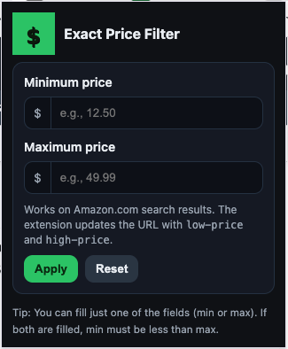

# Amazon Exact Price Filter (Chrome/Webkit Extension)

This extension is intended for users who dislike the price slider control and prefer to use the classic text input interface to set precise **minimum** and **maximum** prices for product search results while shopping on Amazon.com.

The extension updates Amazon's search URL to include support for the filter parameters:

- `low-price=<min>`
- `high-price=<max>`

## Install

1. Download and unzip this folder (or use the ZIP attached in this chat).
2. In Chrome, open `chrome://extensions`.
3. Enable **Developer mode** (top-right).
4. Click **Load unpacked** and select the unzipped folder.
5. Pin the extension if you’d like quick access.

## Use

1. Navigate to an Amazon **search results** page on **amazon.com** (e.g., https://www.amazon.com/s?k=...).
2. Click the extension icon.
3. Enter a **Minimum price** and/or **Maximum price**.
   - If both are provided, **min must be less than max**.
   - You can provide just one (min-only or max-only).
4. Click **Apply** to update the current tab’s URL with the correct parameters.
5. Click **Reset** to clear inputs and remove the price filters from the URL.

### Notes & Tips

- The extension operates only on **amazon.com** pages. (It will not modify tabs on other domains.)
- It reads existing `low-price` / `high-price` values from the URL to prefill the fields when possible.
- The extension uses **Manifest V3** and requires only the `tabs` permission to read/update the active tab’s URL.

## Privacy

No data is collected or sent anywhere. All logic runs locally in the popup and only updates the active tab’s URL.

## Troubleshooting

- If you are not on an Amazon search results page, applying filters may navigate, but filters are most meaningful on `/s` result pages.
- If nothing happens, ensure the tab is on **amazon.com**, not a country-specific domain, and that you’re allowing the extension to run (pinned/visible).

## Contributing

This project is open source and welcomes contributions. You can contribute by reporting bugs, suggesting features, or contributing code.

The source code is available on [GitHub](https://github.com/dnstock/amazon-exact-price-filter-extension). The project is maintained by [Dan Harcsztark](https://github.com/dnstock).

[Pull requests](https://github.com/dnstock/amazon-exact-price-filter-extension/pulls) are welcome. For major changes, please open an issue first to discuss what you would like to change.

## Support, Suggestions, Feedback, Etc.

To report bugs or if you encounter issues or have suggestions, please use the [GitHub issue tracker](https://github.com/dnstock/amazon-exact-price-filter-extension/issues).

## License

This project is freely available and licensed under the MIT License. See the [LICENSE](LICENSE) file for details.

