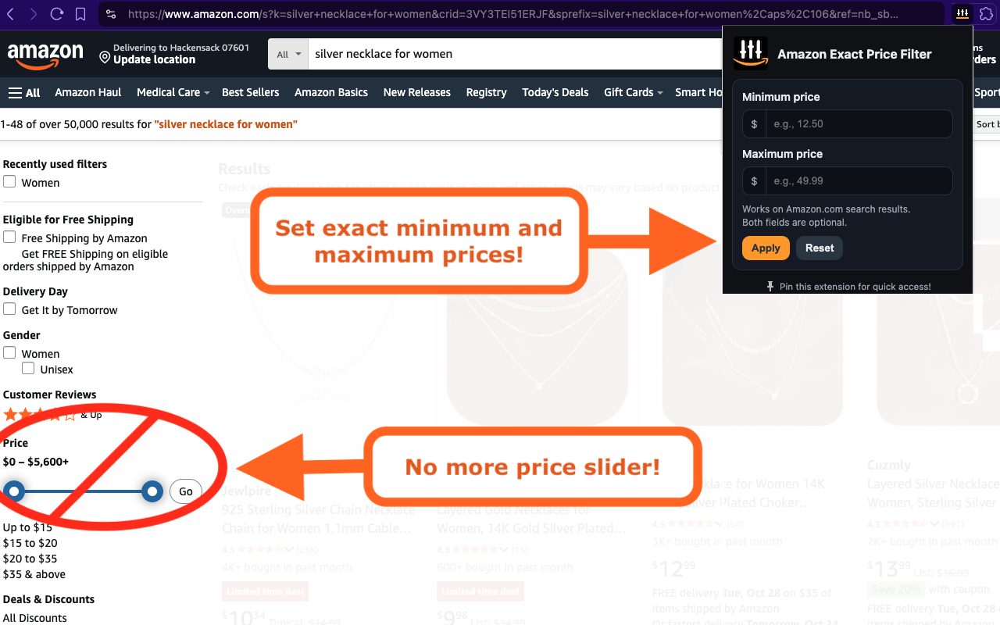
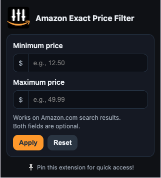

# Amazon.com Exact Price Filter (Chrome/Webkit Extension)

## Overview

This extension allows users to type in exact minimum and maximum prices for product search results while shopping on Amazon.com.

It is intended for anyone who dislikes the newer price slider control and prefers to use the classic text input interface to set a precise range for product prices.

## Get the Extension!

1. Download the extension from the [Chrome Web Store](https://chromewebstore.google.com/detail/johhjkfjfaknndeenoinpiecomheidlj?utm_source=item-share-github) (works on Brave too).
1. Install the extension.
1. Click the extension icon to open the popup.
1. Enjoy a better shopping experience!

> Tip: Pin the extension for quick access!

## Use

1. Navigate to an Amazon **search results** page on **amazon.com** (e.g., https://www.amazon.com/s?k=...).
2. Click the extension icon.
3. Enter a **minimum price** and/or **maximum price**.
   - If both are provided, **min must be less than max**.
   - You can provide just one (min-only or max-only).
4. Click **Apply** to update the current tab’s URL with the correct parameters.
5. Click **Reset** to clear inputs and remove the price filters from the URL.

### Permissions

- The extension operates only on **amazon.com** search pages. (It does not run on other domains.)
- It reads existing low/high price values from the URL to prefill the fields when possible.
- It requires only minimal `tabs` permission to read/update the Amazon search URL.

## Privacy

- No data is collected or sent anywhere. 
- All logic runs locally in the popup and only updates the active tab’s URL.

## Troubleshooting

- If you are not on an Amazon search results page, applying filters may navigate, but filters are most meaningful on `/s` result pages.
- If nothing happens, ensure the tab is on **amazon.com**, not a country-specific domain, and that you’re allowing the extension to run (pinned/visible).

## Install (Developer Mode)

If you want to install the extension for development and testing purposes, follow these steps:

1. Clone this repository.
1. Open your browser and go to `chrome://extensions` (Chrome) or `brave://extensions` (Brave).
1. Enable **Developer mode** (top-right).
1. Click **Load unpacked** and select the folder with this repository.

### Note 
- Running `./pack.sh` will create an `extension.zip` file with just the necessary extension files.

## Contributing

This project is open source and welcomes contributions. You can contribute by reporting bugs, suggesting features, giving feedback, or writing code.

The source code is available on [GitHub](https://github.com/dnstock/amazon-exact-price-filter-extension). The project is maintained by [Dan Harcsztark](https://github.com/dnstock).

[Pull requests](https://github.com/dnstock/amazon-exact-price-filter-extension/pulls) are welcome. For major changes, please open an issue first to discuss what you would like to change.

## Support, Suggestions, Feedback, Etc.

To report bugs or if you encounter issues or have suggestions, please use the [GitHub issue tracker](https://github.com/dnstock/amazon-exact-price-filter-extension/issues).

## License

This project is freely available and licensed under the MIT License. See the [LICENSE](LICENSE) file for details.
